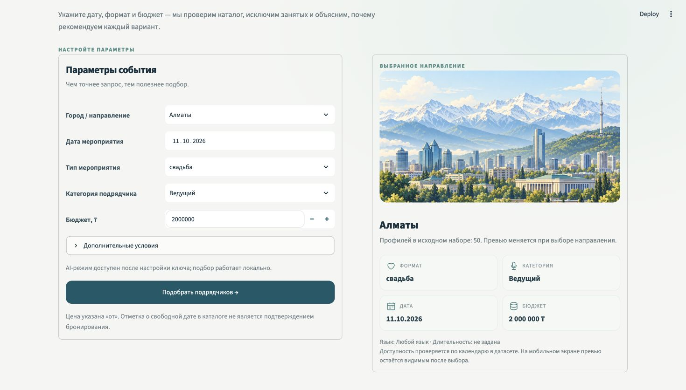
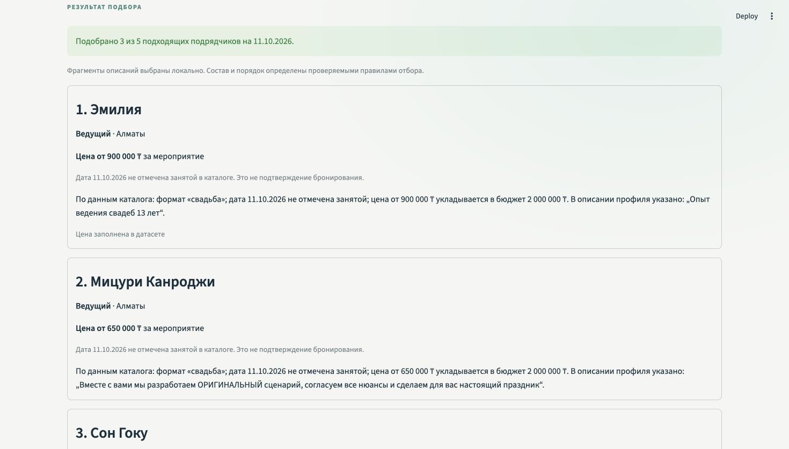

# Select — подбор подрядчиков для событий

Select выбирает **до трёх подрядчиков** под город, дату, формат, категорию и бюджет. Он исключает занятых, объясняет каждую рекомендацию и честно сообщает, если вариантов мало или их нет. Решение кейса **#79-lite, трек 06 HackAlem AI**.



## Запуск

Нужен **Python 3.11+** и интернет для первой установки пакетов. Откройте терминал в корне репозитория.

| macOS / Linux | Windows PowerShell |
| --- | --- |
| `python3 -m venv .venv` | `py -3 -m venv .venv` |
| `./.venv/bin/python -m pip install -r requirements.txt` | `.\.venv\Scripts\python.exe -m pip install -r requirements.txt` |
| `./.venv/bin/python -m streamlit run app.py` | `.\.venv\Scripts\python.exe -m streamlit run app.py` |

Откройте локальный адрес из терминала. **`.env` и API-ключ не нужны:** без них Select использует локальные объяснения. Чистый запуск только с `requirements.txt`, без OpenAI SDK и ключа, проверен отдельно.

## Демо за две минуты

Во всех строках формат — **свадьба**. Для сравнения дат оставайтесь в одной вкладке и каждый раз нажимайте «Подобрать подрядчиков».

| Сценарий | Город · категория | Дата | Бюджет | Результат |
| --- | --- | --- | ---: | --- |
| Плотная категория | Алматы · Ведущий | 10.10.2026 | 2 000 000 ₸ | 3 карточки |
| Смена только даты | Алматы · Ведущий | 11.10.2026 | 2 000 000 ₸ | другая тройка и пояснение занятости |
| Редкая категория | Алматы · Флорист | 10.10.2026 | 300 000 ₸ | 1 карточка и причина нехватки |
| Категории нет | Астана · Декоратор | 10.10.2026 | 3 000 000 ₸ | сообщение об отсутствии категории |
| Не проходит бюджет | Алматы · Ведущий | 10.10.2026 | 100 000 ₸ | объяснение пустой выдачи |

Для проверки площадок: **Алматы · Банкетный зал · 14.11.2026 · 6 000 000 ₸**. Язык и длительность задаются в «Дополнительных условиях». Повтор того же запроса сохраняет порядок.



## Что внутри

| Часть | Задача |
| --- | --- |
| `app.py` · Streamlit 1.64.0 | форма, превью города, карточки и пустые состояния |
| `matcher.py` · Python | календарь, условия допуска и устойчивый порядок |
| `explanations.py` | проверяемые факты и конкретная деталь описания |
| `data/contractors.csv` | 66 анонимизированных профилей, 13 полей; даты 23.09–31.12.2026 |

Цена показана **«от» за мероприятие**; свободная дата в каталоге **не подтверждает бронирование**. Синтетические профили и заполненные при подготовке город/цена помечаются. Бронирования, заявок и уведомлений нет.

OpenAI **необязателен**: модель выбирает один из проверенных фрагментов описания, но не меняет отбор и порядок. Её выбор иногда совпадает с локальным — интерфейс это показывает. При ошибке API работают локальные объяснения. Для AI отдельно установите `requirements-ai.txt` и задайте `OPENAI_API_KEY` в окружении или локальном `.env`; модель по умолчанию — `gpt-4.1-mini`. Не добавляйте ключ в Git. NVIDIA API приложению не нужен.

В разработке участвовали AI-агенты Codex: отдельные задачи по подбору, объяснениям и интерфейсу были интегрированы и проверены вместе. При запуске отдельный агентный сервис не нужен.

## Конфигурация развёртывания

Публичной версии нет: жюри может запустить проект локально. Если понадобится Streamlit Community Cloud, [официальная инструкция](https://docs.streamlit.io/deploy/streamlit-community-cloud/deploy-your-app/deploy) предлагает выбрать репозиторий, ветку и входной файл:

| Настройка | Для Select |
| --- | --- |
| Ветка / входной файл | `main` / `app.py` |
| Python / зависимости | 3.12 / корневой `requirements.txt` |
| Тема | `.streamlit/config.toml` |
| Секреты базового режима | не нужны |

Для AI в облаке дополнительно нужен `openai==2.54.0` в зависимостях окружения и корневой `OPENAI_API_KEY` в Secrets, а не в Git. См. [зависимости](https://docs.streamlit.io/deploy/streamlit-community-cloud/deploy-your-app/app-dependencies) и [секреты](https://docs.streamlit.io/develop/concepts/connections/secrets-management). Деплой не выполнялся.

## Проверки и ограничения

```bash
./.venv/bin/python -m pip install -r requirements-dev.txt
./.venv/bin/python -m pytest -q
```

На Windows используйте `.\.venv\Scripts\python.exe`. Даты вне окна каталога нельзя считать свободными; пустой `max_hours` означает услугу без фиксированного времени на площадке. Подробный контракт — в [MVP_CONTRACT.md](MVP_CONTRACT.md).
